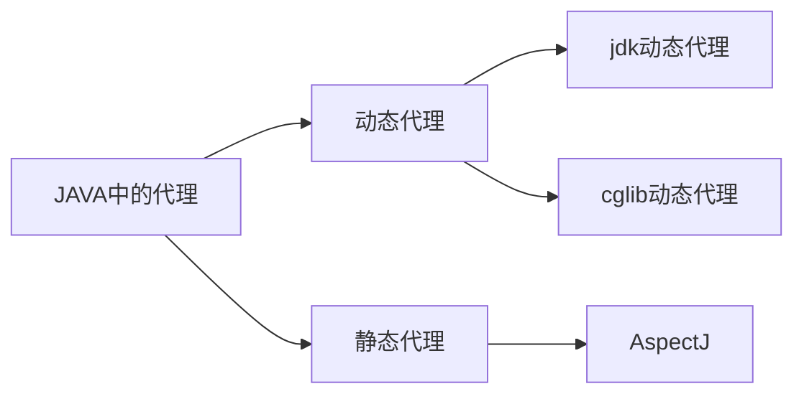

是兄弟就来看我的博客

<!-- more -->

### 1、代理的分类

### 2、各种代理的区别

#### 2.1 动态代理
> 动态代理指的是程序**运行期间**动态的生成代理类，比如jdk的动态代理，技术上是通过反射来生成代理的类。cglib也是在运行时动态生成代理类，和jdk动态代理区别在于cglib是利用asm开源框架直接操作class字节码文件来生成代理类。

#### 2.2 静态代理
> 静态代理值得是在**编译期间**就已经生成了一个新的代理类，比如：AspectJ，Lombok

### 3、Spring中提到的AOP和AspectJ属于什么代理
#### 3.1 SpringAOP
SpringAOP只是对Jdk动态代理或者Cglib进行了封装，默认使用的是Jdk动态代理，当代理的类是一个接口时直接用jdk动态代理，当被代理的目标类不是接口，则调用Cglib进行代理。
#### 3.2 AspectJ
一个静态代理框架，在编译期间使用acj**编译期**自动生成代理类

### 4、比较几种代理
#### 4.1 Jdk动态代理和Cglib动态代理区别
| Jdk动态代理         | Cglib                                    |
| :------------------ | :--------------------------------------- |
| 代理目标是接口      | 可代理普通类，生成普通类的子类当作代理类 |
| 使用反射生成代理类  | 使用asm开源框架操作字节码                |
| Java 语言自带的功能 | 需要导入cglib包                          |
| 反射性能较低        | 直接修改字节码性能好                     |

#### 4.2 SpringAOP和AspectJ区别
springapo和aspectj区别

| SPRING AOP                                                   | ASPECTJ                                                      |
| :----------------------------------------------------------- | :----------------------------------------------------------- |
| Implemented in pure Java                                     | Implemented using extensions of Java programming language    |
| No need for separate compilation process                     | Needs AspectJ compiler (ajc) unless LTW is set up            |
| Only runtime weaving is available                            | Runtime weaving is not available. Supports compile-time, post-compile, and load-time Weaving |
| Less Powerful – only supports method level weaving           | More Powerful – can weave fields, methods, constructors, static initializers, final class/methods, etc… |
| Can only be implemented on beans managed by Spring container | Can be implemented on all domain objects                     |
| Supports only method execution pointcuts                     | Support all pointcuts                                        |
| Proxies are created of targeted objects, and aspects are applied on these proxies | Aspects are weaved directly into code before application is executed (before runtime) |
| Much slower than AspectJ                                     | Better Performance                                           |
| Easy to learn and apply                                      | Comparatively more complicated than Spring AOP               |


### 5、各种代理的详细介绍以及示例代码
#### 5.1 Jdk动态代理

##### 5.1.1 jdk动态代理实现的原理

 1. jdk动态代理的入口`java.lang.reflect.Proxy`

    ```java
    //java.lang.reflect.Proxy#newProxyInstance
    /*Params:
            loader – the class loader to define the proxy class
            interfaces – the list of interfaces for the proxy class to implement
            h – the invocation handler to dispatch method invocations to 
    */
    public static Object newProxyInstance(ClassLoader loader,Class<?>[] interfaces,InvocationHandler h)
    ```

    loader： 类加载器，用来加载代理目标的

    interfaces： 指定你要代理（增强）的接口，[jdk动态代理只能代理接口](#4.1 Jdk动态代理和Cglib动态代理区别)

    h：代理处理器，所有的代理增强都在这个处理器中的invoke中处理，在调用原方法时，会回调这个h对象的invoke方法，具体的参考后面的示例以及解析出来的代理类的代码。

    return ：返回的Object就是生成的代理对象

2. 创建代理对象传参loader和class都好说，那么InvocationHandler怎么获得呢？

   ```java
   public interface InvocationHandler {
       /**
       *Params:
       *proxy - 生成的代理对象，在生成的代理类中可以看到此处的proxy是通过this把自身传入了进来；
       *method - 原对象的method实例
       *args - 原对象方法的参数
       */
       public Object invoke(Object proxy, Method method, Object[] args)
           throws Throwable;
   }
   ```

   > 看源码可知，这是一个只包含invoke方法的接口类，使用第一步创建的代理对象，调用方法时会回调InvocationHandler中的invoke，，在invoke中我们可以修改原来的方法逻辑，比如在原方法前后打印一些东西。实际使用中我们需要自定义一个类来实现InvocationHandler，重写invoke

##### 5.1.2 jdk动态代理demo

```java
//创建一个接口，使用代理的方式在add方法执行前后打印点东西
public interface Executor {
    int add(int x, int y);
}
```

```java
//接口实现类
public class ExecutorImpl implements Executor {
    @Override
    public int add(int x, int y) {
        System.out.println("调用add方法");
        return x + y;
    }
}
```

```java
//InvocationHandler实现类，在此对被代理的对象的方法进行增强
public class LogTimeInvocationHandler implements InvocationHandler {
    /**
     * 被代理的对象（源对象）
     */
    private Object source;

    public LogTimeInvocationHandler(Object source) {
        this.source = source;
    }

    @Override
    public Object invoke(Object proxy, Method method, Object[] args) throws Throwable {
        for (int i = 0; i < args.length; i++) {
            System.out.println("参数：" + args[i]);
        }
        System.out.println("我在原方法执行前打印。。。");
        Object result = method.invoke(source, args);
        System.out.println("我在原方法执行后打印。。。");
        return result;
    }
}
```

```java
//主函数类，包含执行代理方法，以及打印代理方法
public class DynamicProxyTest {
    public static void main(String[] args) {
        //1. 创建一个代理对象，Proxy会自动返回一个代理类，此类是Excutor的子类
        Executor executor = (Executor) Proxy.newProxyInstance(Executor.class.getClassLoader(), new Class[]{Executor.class}, new LogTimeInvocationHandler(new ExecutorImpl()));
        //2. 把自动生成的代理对象打印到文件，方便查看分析
        Class<?> proxyClass = Proxy.getProxyClass(Executor.class.getClassLoader(), new Class[]{Executor.class});
        saveClass("$UserProxy", proxyClass.getInterfaces(), "/home/chenkun/Desktop/");
        //3. 使用代理对象调用
        int add = executor.add(1, 2);
    }

    /**
     * 生成代理类 class 并保持到文件中
     *
     * @param className  生成的代理类名称
     * @param interfaces 代理类需要实现的接口
     * @param pathdir    代理类保存的目录路径,以目录分隔符结尾
     */
    public static void saveClass(String className, Class<?>[] interfaces, String pathdir) {
        /**
         * 第一个参数是 代理类 名 。
         * 第二个参数是 代理类需要实现的接口
         */
        byte[] classFile = ProxyGenerator.generateProxyClass(className, interfaces);
        /**
         * 如果目录不存在就新建所有子目录
         */
        Path path1 = Paths.get(pathdir);
        if (!path1.toFile().exists()) {
            path1.toFile().mkdirs();
        }
        String path = pathdir + className + ".class";
        try (FileOutputStream fos = new FileOutputStream(path)) {
            fos.write(classFile);
            fos.flush();
            System.out.println("代理类class文件写入成功");
        } catch (Exception e) {
            System.out.println("写文件错误");
        }
    }

    /**
     * 设置保存Java动态代理生成的类文件。
     *
     * @throws Exception
     */
    public static void saveGeneratedJdkProxyFiles() throws Exception {
        Field field = System.class.getDeclaredField("props");
        field.setAccessible(true);
        Properties props = (Properties) field.get(null);
        props.put("sun.misc.ProxyGenerator.saveGeneratedFiles", "true");
    }
}
```

解析出来的动态生成的代理类，其实是一个同时实现Proxy和我们目标接口Executor的一个代理类，Proxy类中有个属性就是`InvocationHandler`

```java
import com.chen.base.proxy.Executor;
import java.lang.reflect.InvocationHandler;
import java.lang.reflect.Method;
import java.lang.reflect.Proxy;
import java.lang.reflect.UndeclaredThrowableException;

public final class $ExecutorProxy0 extends Proxy implements Executor {
    private static Method m1;
    private static Method m2;
    private static Method m3;
    private static Method m0;

    public $ExecutorProxy0(InvocationHandler var1) throws  {
        super(var1);
    }

    public final boolean equals(Object var1) throws  {
        try {
            return (Boolean)super.h.invoke(this, m1, new Object[]{var1});
        } catch (RuntimeException | Error var3) {
            throw var3;
        } catch (Throwable var4) {
            throw new UndeclaredThrowableException(var4);
        }
    }

    public final String toString() throws  {
        try {
            return (String)super.h.invoke(this, m2, (Object[])null);
        } catch (RuntimeException | Error var2) {
            throw var2;
        } catch (Throwable var3) {
            throw new UndeclaredThrowableException(var3);
        }
    }

    public final int add(int var1, int var2) throws  {
        try {
            return (Integer)super.h.invoke(this, m3, new Object[]{var1, var2});
        } catch (RuntimeException | Error var4) {
            throw var4;
        } catch (Throwable var5) {
            throw new UndeclaredThrowableException(var5);
        }
    }

    public final int hashCode() throws  {
        try {
            return (Integer)super.h.invoke(this, m0, (Object[])null);
        } catch (RuntimeException | Error var2) {
            throw var2;
        } catch (Throwable var3) {
            throw new UndeclaredThrowableException(var3);
        }
    }

    static {
        try {
            m1 = Class.forName("java.lang.Object").getMethod("equals", Class.forName("java.lang.Object"));
            m2 = Class.forName("java.lang.Object").getMethod("toString");
            m3 = Class.forName("com.chen.base.proxy.Executor").getMethod("add", Integer.TYPE, Integer.TYPE);
            m0 = Class.forName("java.lang.Object").getMethod("hashCode");
        } catch (NoSuchMethodException var2) {
            throw new NoSuchMethodError(var2.getMessage());
        } catch (ClassNotFoundException var3) {
            throw new NoClassDefFoundError(var3.getMessage());
        }
    }
}

```

自动生成的代理类中有个add方法，此方法回调了InvocationHandler的invoke方法，因此可以对原方法进行增强

```java
 public final int add(int var1, int var2) throws  {
        try {
            return (Integer)super.h.invoke(this, m3, new Object[]{var1, var2});
        } catch (RuntimeException | Error var4) {
            throw var4;
        } catch (Throwable var5) {
            throw new UndeclaredThrowableException(var5);
        }
    }
```


#### 5.2 Cglib动态代理

##### 5.2.1

使用cglib需要添加依赖包

```xml
<!-- https://mvnrepository.com/artifact/cglib/cglib -->
<dependency>
    <groupId>cglib</groupId>
    <artifactId>cglib</artifactId>
    <version>3.3.0</version>
</dependency>

```


##### 5.2.2 cglib代理demo

```java
public class CGLibDemo {

    static class Car {
        public void run() {
            System.out.println("the car is running");
        }
    }

    static class CglibProxy<T> implements MethodInterceptor {

        private T target;// 代理对象

        public T getInstance(T target) {
            this.target = target;
            Enhancer enhancer = new Enhancer();
            enhancer.setSuperclass(this.target.getClass());
            enhancer.setCallback(this);
            return (T) (enhancer.create());
        }

        @Override
        public Object intercept(Object o, Method method, Object[] args, MethodProxy methodProxy) throws Throwable {
            preOperation();
            Object retVal = methodProxy.invoke(this.target, args);
            postOperation();
            return retVal;
        }

        private void postOperation() {
            System.out.println("后置处理...");
        }

        private void preOperation() {
            System.out.println("前置处理...");
        }

    }

    public static void main(String[] args) {
        CglibProxy<Car> cglibProxy = new CglibProxy<>();
        Car car = cglibProxy.getInstance(new Car());
        car.run();
    }

}
```


#### 5.3 、SpringAOP 在springboot项目中使用

##### 5.3.1  、SpringAOP

SpringAOP和AspectJ不是竞争关系，事实SpringAOP在项目中使用一般还依赖AspectJ,比如[以下代码](#SpringAop的demo)中的几个注解`@Aspect @Before @After`等是来自AspectJ，但SpringAOP也仅仅是使用了AspectJ中的注解，并没有引入AspectJ的编译器，其使用比AspectJ简单方便多了。他俩的关系可以[参考此处](https://pdai.tech/md/spring/spring-x-framework-aop.html#spring-aop%E5%92%8Caspectj%E6%98%AF%E4%BB%80%E4%B9%88%E5%85%B3%E7%B3%BB)

##### 5.3.2 SpringAop的demo

```xml
<!--导入依赖--> 	 
<dependency>
            <groupId>org.springframework.boot</groupId>
            <artifactId>spring-boot-starter-aop</artifactId>
        </dependency>
```

```java
//在所有com.chen.controller包下的所有类，所有方法都应用增强
@Aspect
@Component
public class MyAdvice {

    @Pointcut("execution (* com.chen.controller.*.*(..))")
    public void test() {

    }

    @Before("test()")
    public void beforeAdvice() {
        System.out.println("beforeAdvice...");
    }

    @After("test()")
    public void afterAdvice() {
        System.out.println("afterAdvice...");
    }

    @Around("test()")
    public void aroundAdvice(ProceedingJoinPoint proceedingJoinPoint) {
        System.out.println("before");
        try {
            proceedingJoinPoint.proceed();
        } catch (Throwable t) {
            t.printStackTrace();
        }
        System.out.println("after");
    }
}
```


```java
@RestController
@RequestMapping("/")
public class HelloController {
    @RequestMapping("userinfo")
    public String getUserInfo() {
        System.out.println("执行目标方法。。。。");
        return "user...";
    }
}
```


输出结果：

```shell
before
beforeAdvice...
执行目标方法。。。。
afterAdvice...
after

```


#### 5.4 AspectJ

//TODO 未完待续

### 6、参考

[JDK Proxy和Cglib代理的区别](https://blog.csdn.net/xiewenfeng520/article/details/107554411#t7)
