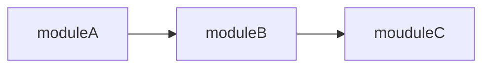

# 1、继承

> 继承使用场景  
把公共的依赖都放在父模块，在子模块通过parent引用，使用了parent后，在父模块中**dependencies**定义的依赖会自动传递到子模块。

```xml
  <parent>
        <artifactId>ChenSino</artifactId>
        <groupId>com.chensino</groupId>
        <version>0.0.1-SNAPSHOT</version>
    </parent>
```

如果父模块中有的包不是所有子模块都需要的，可以配置按需引用，只需要把包放在父模块的dependencyManagement下即可，放在此标签下的包不会自动继承到子模块，如果子模块需要此标签下的包，需要显示的引入dependency，但是不需要配置version，会自动使用父模块中的版本，如果子模块配置了version会自动覆盖父模块的version。

> 实例
**父模块配置**
父模块中有lombok，但是子模块不会自动继承

```xml
<?xml version="1.0" encoding="UTF-8"?>
<project xmlns="http://maven.apache.org/POM/4.0.0"
         xmlns:xsi="http://www.w3.org/2001/XMLSchema-instance"
         xsi:schemaLocation="http://maven.apache.org/POM/4.0.0 http://maven.apache.org/xsd/maven-4.0.0.xsd">
    <modelVersion>4.0.0</modelVersion>

    <artifactId>core</artifactId>
    <groupId>com.chensino</groupId>
    <version>0.0.1-SNAPSHOT</version>
    <packaging>pom</packaging>

    <properties>
        <maven.compiler.source>11</maven.compiler.source>
        <maven.compiler.target>11</maven.compiler.target>
    </properties>

   <dependencyManagement>
     <dependencies>
        <dependency>
            <groupId>org.projectlombok</groupId>
            <artifactId>lombok</artifactId>
            <version>1.18.24</version>
        </dependency>
     </dependencies>
    </dependencyManagement>
</project>
```

**子模块配置**
子模块要想使用lombok，必须显式引用，但是不用指定version
```xml
<dependencies>
    <dependency>
        <groupId>org.projectlombok</groupId>
        <artifactId>lombok</artifactId>
    </dependency>
</dependencies>
```

**总结**  
>继承解决的是公共依赖的问题，使用parent继承时，会继承dependencies下所有的依赖，但是不会继承dependencyManagement下的依赖，要想使用就要显式引用，但是不用配置version

# 2、聚合
>使用场景  

如果我们的项目分成了好几个模块，那么我们构建的时候是不是有几个模块就需要构建几次了（到每个模块的目录下执行 mvn 命令）？  
当然，你逐个构建没问题，但是非要这么麻烦的一个一个的构建吗  
简单的做法就是使用聚合，一次构建全部模块  

# 3、依赖
# 4、dependencies  vs dependencyManagement

它们的区别在第一节已经说明了，这里说一下dependencyManagement使用的注意事项。
假如我有3个模块分别是moudelA、moduleB、moduleC，moduleB依赖于moduleB，moduleB依赖于moduleC



> 需求场景  
> 把moduleC的dependencyManagement中定义的依赖继承到moduleB，然后在业务模块A中直接通过无版本号方式引入lombok使用

moduleC的pom：
```xml
 <dependencyManagement>
        <dependencies>
            <dependency>
                <groupId>org.projectlombok</groupId>
                <artifactId>lombok</artifactId>
                <version>${lombok.version}</version>
                <optional>true</optional>
            </dependency>
            <dependency>
                <groupId>com.chensino</groupId>
                <artifactId>core-api</artifactId>
                <version>${chensino.version}</version>
            </dependency>
        </dependencies>
    </dependencyManagement>
```
moduleB的pom：
```xml
<dependencyManagement>
        <dependencies>
            <dependency>
                <groupId>com.chensino</groupId>
                <artifactId>common-bom</artifactId>
                <version>${project.version}</version>
                <type>pom</type>
                <scope>import</scope>
            </dependency>     
        </dependencies>
    </dependencyManagement>
```
moduleA的pom：
```xml
 <dependencies>
    <dependency>
        <groupId>org.projectlombok</groupId>
        <artifactId>lombok</artifactId>
    </dependency>
</dependencies>
```
要注意的是，moduleB如果想把moduleA中dependencyManagement中的内容继承过来，需要指定type为pom，以及scope为import，如果不指定在A模块直接使用会提示没有lombok版本号


