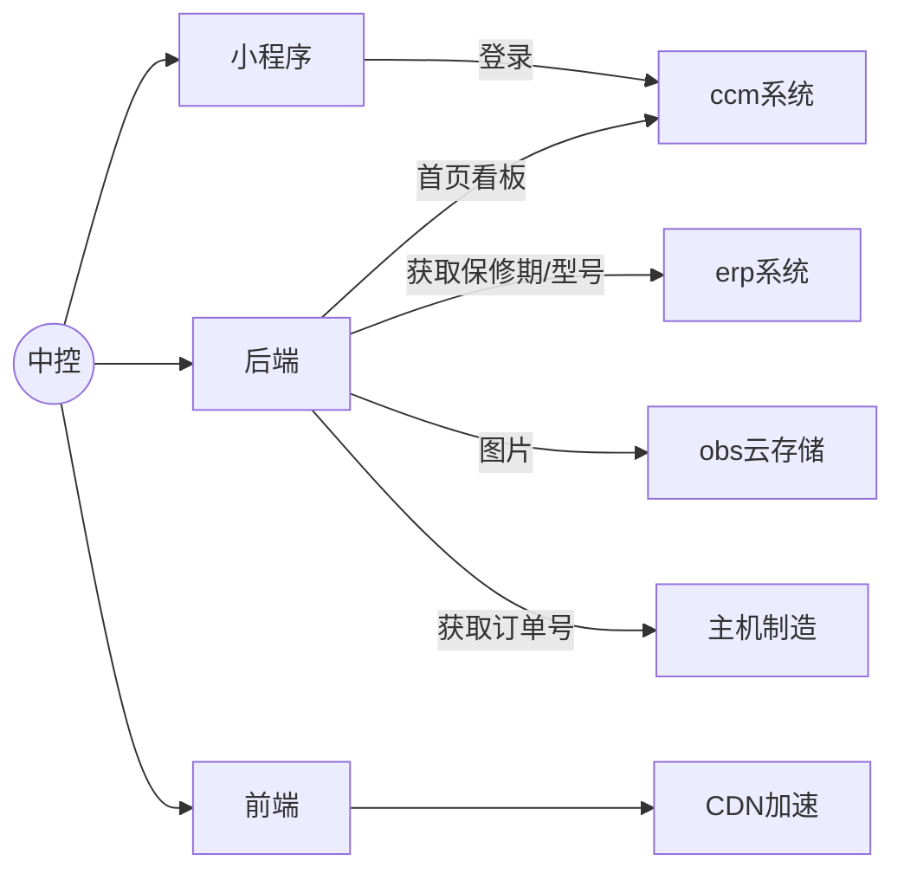
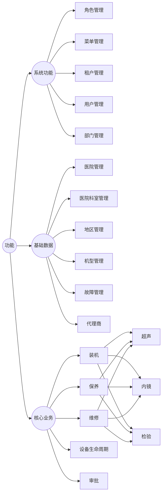

---
title: 用服业务
date: 2018-12-15
categories:
  - 杂记
--- 

## 1、系统划分



## 2、具体业务划分



## 3、内外网系统交互

### 3.1 通过FRP打通内外网

> 我有一个在局域网内部的机器，可以访问外网，但是没有公网ip,我又不想麻烦it同事，那么如何通过公网来访问这个内网的服务？
>
> 答：可以使用FRP

使用的条件：

1. 有一个内网机器（需要访问外网权限），上面部署了想在外网访问的服务
2. 有一个公网ip的机器

#### 3.1.1 FRP在中控的使用

中控的一部分首页看板数据需要从ccm数据库获取，而ccm的数据库在内网，此处使用的是FRP内网穿透技术来实现公网访问内网。


**具体实现原理：**

1. 中控云服务器部署FRPS（h.sonocape.com），启动端口7000
2. 内网服务器部署FRPC(10.10.100.68)，监听端口7000，同时在服务端启动一个1006端口，映射到本地3306数据库

```shell
[common]
# 内网穿透服务器监听的IP地址，默认 127.0.0.1
bind_addr = 0.0.0.0
bind_port = 7000
token = sonoscape
#监控界面配置
dashboard_addr = 0.0.0.0
dashboard_port = 7500
# 监控界面账号密码
dashboard_user = xx
dashboard_pwd = xx

```

```shell
[common]
tls_enable = true
server_addr = 159.138.45.48
server_port = 7000
token=xx

[67-ccm-mysql]
type = tcp
local_ip = 127.0.0.1
local_port = 3306
remote_port = 1006

```


通过以上配置后，FRP客户端会在外网服务器启动一个1006端口，访问`h.sonoscape.com:1006`就等于访问内网那个的`10.10.102.106:3306`

云服务器的配置：


上图中devie-mysql我在hosts中配置映射到了127.0.0.1，在云服务器上访问`device-mysql:1006`会自动映射到内网`10.10.102.106:3306`

以上FRP实现其实就是一个反向代理。

### 3.2 找IT申请外网端口

中控请求主机制造的接口采用的这种方式


### 3.3 从业务角度优化访问内网数据慢的问题

**内网查询慢的原因：**

之前的设计是在分页查询到结果后，采用循环发送http请求到内网系统请求数据。

**优化方法：**

在新增装机时发送一次请求到内网，然后把数据存到中控，后续查询一律从中控直接取

## 4、后续的用服业务规划


1. 迁移ccm到中控直接集成到现有的ccs-data微服务

2. 用服bom接入中控微服务，打通中控和bom的数据交互

   
