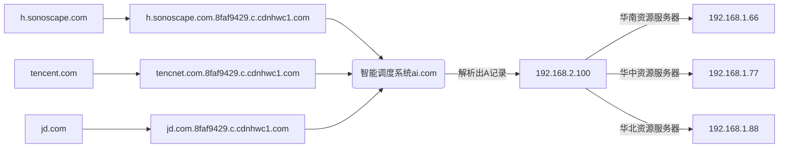

<!--more-->

[TOC]


> 问题： 
> 1. 一个域名能解析出多少个IP？
> 2. 请求一个地址，加www和不加是否有区别？

---

# 一、DNS

本章节参考[DNS 原理入门——阮一峰](https://www.ruanyifeng.com/blog/2016/06/dns.html)
## 1.1 什么是DNS
DNS （Domain Name System 的缩写）的作用非常简单，就是根据域名查出IP地址。你可以把它想象成一本巨大的电话本。
举例来说，如果你要访问域名math.stackexchange.com，首先要通过DNS查出它的IP地址是151.101.129.69。
## 1.1 A（Address）记录
A (Address) 记录是用来指定主机名（或域名）对应的IP地址记录。用户可以将该域名下的网站服务器指向到自己的web server上。
同时也可以设置您域名的二级域名。一般情况下我们收的域名都指的是A记录，比如sonoscape.com，dccm.sonoscape.com，meet.sonoscape.com
都是A记录
## 1.2 CNAME（Canonical Name）
### 1.2.1 定义
CName记录是Canonical Name的简称，通常称别名指向，CNAME记录可用于将一个域名别名为另一个规范名称的域名系统（DNS）资源记录。

> 以下摘自国内某dns服务商文档
>
> 如果需要将域名指向另一个域名，再由另一个域名提供 IP 地址，就需要添加 CNAME 记录，最常用到 CNAME 的场景包括做 CDN、做企业邮箱。

### 1.2.2 参考博客
[Cname存在的意义](https://www.zhihu.com/question/22916306)
[cname解析过程](https://blog.csdn.net/weixin_29898627/article/details/112337714)
> **注意**  
> CNAME只是一个相对的叫法，CNAME相对A记录叫CNAME，但是它本身也是一条A记录
### 1.2.2 场景
- CDN加速
- 为特定网络服务（例如电子邮件或 FTP）提供单独的主机名，并将该主机名指向根域
- 许多托管服务在服务提供商的域（例如 company.hostname.com）上为每个客户提供一个子域，并使用 CNAME 指向客户的域（www.company.com）。
- 在多个国家注册同一个域并将国家版本指向主“.com”域
- 从同一组织拥有的多个网站指向一个主网站 - 
- 用于 SSL 证书申请时的域名验证，例如 _dnsauth.yryz.net CNAME mnwwgx3uijnhsvkyjezf6nlpkn4xotzrkjpto6tfgbbuu22g.dcv.httpsauto.com.
## 1.3 NS（Name Server）记录
NS(Name Server）记录是域名服务器记录，用来指定该域名由哪个DNS服务器来进行解析。比如指定`sonoscape.com`的子域名具体由哪个服务器进行解析（参考后续dig指令）

ns记录查询使用指令：
```shell
$ dig ns com
$ dig ns sonoscape.com
```
示例：
```shell
$ dig ns sonoscape.com.

; <<>> DiG 9.11.4-P2-RedHat-9.11.4-26.P2.el7_9.5 <<>> ns sonoscape.com.
;; global options: +cmd
;; Got answer:
;; ->>HEADER<<- opcode: QUERY, status: NOERROR, id: 46670
;; flags: qr rd ra; QUERY: 1, ANSWER: 2, AUTHORITY: 0, ADDITIONAL: 1

;; OPT PSEUDOSECTION:
; EDNS: version: 0, flags:; udp: 4096
;; QUESTION SECTION:
;sonoscape.com.                 IN      NS

;; ANSWER SECTION:
sonoscape.com.          3600    IN      NS      ns1.icp100.net.
sonoscape.com.          3600    IN      NS      ns2.icp100.net.

;; Query time: 97 msec
;; SERVER: 100.125.1.250#53(100.125.1.250)
;; WHEN: Tue Jul 12 11:13:32 CST 2022
;; MSG SIZE  rcvd: 88

```
## 1.4 DNS分析实战
分析使用dig命令，如下`dig +trace h.sonoscape.com`，分析`h.sonoscape.com`域名解析过程
```shell
$ dig +trace h.sonoscape.com

; <<>> DiG 9.11.4-P2-RedHat-9.11.4-26.P2.el7_9.5 <<>> +trace h.sonoscape.com
;; global options: +cmd
.                       472260  IN      NS      a.root-servers.net.
.                       472260  IN      NS      h.root-servers.net.
.                       472260  IN      NS      b.root-servers.net.
.                       472260  IN      NS      g.root-servers.net.
.                       472260  IN      NS      m.root-servers.net.
.                       472260  IN      NS      l.root-servers.net.
.                       472260  IN      NS      d.root-servers.net.
.                       472260  IN      NS      i.root-servers.net.
.                       472260  IN      NS      j.root-servers.net.
.                       472260  IN      NS      c.root-servers.net.
.                       472260  IN      NS      e.root-servers.net.
.                       472260  IN      NS      f.root-servers.net.
.                       472260  IN      NS      k.root-servers.net.
.                       472260  IN      RRSIG   NS 8 0 518400 20220724050000 20220711040000 20826 . FZHYJQfCqUyzGmFm5rX40WBtbYNLRihMeE+ShEnhLJwV7XgAHidoNfh4 XAYL1BmOmBkMpZoffPF+BZ3/E4qQRPv9oMMd+uvEjAXoHMb6kI/2CMa4 ejTDy28Zr1YacUO70dk3bPF9TisNotaCzJFa1SOZ2a9WXDgzJe31DAyR rxchvGHz1/cLryangX9bgKWqu7MtE4TaXVpxYZM/L0eeUaxw1q15GXiG mM39zc+UHjA3TwjvUS7/7+6X9nvMbhDBNUUCxPMIKMMmoUUptBZ56HKU 1wQYf/iG+0XkZnH8hPVLZPoaj7EJQMbgpaGrHamDkprtmg7mRwRUPhgD jAA9kQ==
;; Received 525 bytes from 100.125.1.250#53(100.125.1.250) in 0 ms

com.                    172800  IN      NS      a.gtld-servers.net.
com.                    172800  IN      NS      b.gtld-servers.net.
com.                    172800  IN      NS      c.gtld-servers.net.
com.                    172800  IN      NS      d.gtld-servers.net.
com.                    172800  IN      NS      e.gtld-servers.net.
com.                    172800  IN      NS      f.gtld-servers.net.
com.                    172800  IN      NS      g.gtld-servers.net.
com.                    172800  IN      NS      h.gtld-servers.net.
com.                    172800  IN      NS      i.gtld-servers.net.
com.                    172800  IN      NS      j.gtld-servers.net.
com.                    172800  IN      NS      k.gtld-servers.net.
com.                    172800  IN      NS      l.gtld-servers.net.
com.                    172800  IN      NS      m.gtld-servers.net.
com.                    86400   IN      DS      30909 8 2 E2D3C916F6DEEAC73294E8268FB5885044A833FC5459588F4A9184CF C41A5766
com.                    86400   IN      RRSIG   DS 8 1 86400 20220724210000 20220711200000 20826 . JI/mZX93H38W8iBGP641o/cqP4pMc+uVqGLFRDxdMrZszlpx1Fbw9q9w YoC93QLhyaoPTIfYurlImcOmtznIkgIFRRO/ceMai0ZbxhOr/++jQZ0I p1f0oHRhEKFcgvcNWND0gHOMwD7/qOAN6+lTwq5QHtve0OE4Q6y58ipk ruYDGCqgSjq6fiisD7oek5wV8JnjsyZ2a3JVf4z8VjjNGyoYAuPnqfU7 6laXwZ63a20vkpUbTeohLQu0FpUgzwxtAUi5M6Y5SXQuH0eS+DvLtfnG uee0KC50u08tAddlCm7rx8p9eUvJgiqPuScbohtVC767sVlTzbDc/Qvs DtEEzA==
;; Received 1175 bytes from 198.41.0.4#53(a.root-servers.net) in 39 ms

sonoscape.com.          172800  IN      NS      ns1.icp100.net.
sonoscape.com.          172800  IN      NS      ns2.icp100.net.
CK0POJMG874LJREF7EFN8430QVIT8BSM.com. 86400 IN NSEC3 1 1 0 - CK0Q2D6NI4I7EQH8NA30NS61O48UL8G5 NS SOA RRSIG DNSKEY NSEC3PARAM
CK0POJMG874LJREF7EFN8430QVIT8BSM.com. 86400 IN RRSIG NSEC3 8 2 86400 20220718042400 20220711031400 37269 com. OqHMj8b2ZtnK/yLvlzh6HoFolzEZKjLjE2LBlMvL/9jNZsDvr9Mw1ssx HgckOUjba4gjVFDqpSKmyakdWtDsb0HaR13wvk7B2zphtOpqtY+R3G/6 IIjyMxwtxbdwCBF2isSyWisxdm0DVNfTtr6dDrB6xf7M5SDLXK+pweCy BwFoZ3vjutI7JQ19jEqjdpSL21ngvT/XV+tBJunhefJuOQ==
I5JNTE8RF3S2GOJTLECHDOFMFO04OOPJ.com. 86400 IN NSEC3 1 1 0 - I5JOHOKDVEBNVA6LEJN5MU8C1DO2RLIV NS DS RRSIG
I5JNTE8RF3S2GOJTLECHDOFMFO04OOPJ.com. 86400 IN RRSIG NSEC3 8 2 86400 20220718044742 20220711033742 37269 com. GoPLkFjFLCyl9IdTipgwCoBGevEEQZUISUBMXoBNXQYzo+pwa8SSY20b QTCx0L2XoyaC47TBBN3K+Z+a2JKUEAVdrd7Qe+P/HJrH85B+tZTa2FNh pWRIv0UdLGhHrQP4/cDTFSO/Xhh56AqnQwiTVJIJOcqOYWP0tPOqLc9p b2LqInMXzO438B5CaTsOD36BV7+mEwRp1GTW6XJGBpZyGg==
;; Received 639 bytes from 192.41.162.30#53(l.gtld-servers.net) in 156 ms

h.sonoscape.com.        3600    IN      A       159.138.45.48
;; Received 60 bytes from 46.165.246.211#53(ns1.icp100.net) in 328 ms

```
# 二、CDN
## 2.1 什么是CDN
[CDN介绍](https://chensino.github.io/docs/other/essay/CDN.html)
## 2.2 CDN原理

## 2.3 CDN是如何使用CNAME
[前面章节介绍了CDN原理图](# 2.2 cdn原理)
cdn本质就是就近获取资源，节省时间，具体如何获取到就近的资源服务器，就是通过CDN智能调度系统。比如中控系统服务器A记录
是h.sonoscape.com，华为给分配的CNAME是h.sonoscape.com.8faf9429.c.cdnhwc1.com，现在的场景是我想访问h.sonoscape.com
时，我想让被访问的资源加速，h.sonoscape.com.8faf9429.c.cdnhwc1.com指向了一个华为的智能调度系统，如何保证访问h.sonoscape.com
自动跳到智能调度系统（h.sonoscape.com.8faf9429.c.cdnhwc1.com）呢？答案不言而喻，就是把h.sonoscape.com.8faf9429.c.cdnhwc1.com这个
A记录变成h.sonoscape.com的CNAME，[前面介绍了cname具体作用](## 1.2 cname)，刚好符合这个场景。

## 2.4 CNAME为什么不直接解析到ip，而是域名


上图中有开立、腾讯、京东使用了华为的CDN的加速服务，则华为的角色是服务提供商，对外提供cname以及智能调度系统，分别给三家公司分配了cname，如果cname直接绑定IP，若是某天华为智能调度系统换了ip，那么他的客户们的服务就也要全部改ip，这是不合理的，不可能要求每个客户都去改ip。cname解析到域名就不存在这个问题，华为调度系统换机器时，只需要把调度系统ai.com绑定到新的ip即可，用户的服务不受影响。

# 三、对象存储

## 3.1 什么是对象存储

Amazon 是最早提供对象存储服务 的厂商，制定文件存储相关的业内标准，推出S3协议标准。

**Amazon S3**

Amazon Simple Storage Service (Amazon S3) 是一种对象存储服务，提供行业领先的可扩展性、数据可用性、安全性和性能。各种规模和行业的客户可以为几乎任何使用案例存储和保护任意数量的数据，例如数据湖、云原生应用程序和移动应用程序。通过经济高效的存储类和易于使用的管理功能，您可以优化成本、组织数据并配置精细调整过的访问控制，从而满足特定的业务、组织和合规性要求。


**华为对象存储**

对象存储服务（Object Storage Service,OBS）是一个基于对象的存储服务，为客户提供海量、安全、高可靠、低成本的数据存储能力，使用时无需考虑容量限制，并且提供多种存储类型供选择，满足客户各类业务场景诉求。

**阿里云对象存储**

阿里云对象存储OSS（Object Storage Service）是一款海量、安全、低成本、高可靠的云存储服务，提供99.9999999999%(12个9)的数据持久性，99.995%的数据可用性。多种存储类型供选择，全面优化存储成本

**腾讯云对象储存**

对象存储（Cloud Object Storage，COS）是由腾讯云推出的无目录层次结构、无数据格式限制，可容纳海量数据且支持 HTTP/HTTPS 协议访问的分布式存储服务。腾讯云 COS 的存储桶空间无容量上限，无需分区管理，适用于 CDN 数据分发、数据万象处理或大数据计算与分析的数据湖等多种场景。

**开源对象存储Minio**

minio是基于S3协议的开源存储系统，需要自己搭建服务，优点是免费，缺点是扩展麻烦，稳定性不如云服务。

> 我组现用的obs是华为的存储服务

| 厂商      | 地址                        |
| --------- | --------------------------- |
| 阿里云oss | https://www.aliyun.com      |
| 华为云obs | https://www.huaweicloud.com |
| 腾讯云ocs | https://cloud.tencent.com   |
| 七牛云    | https://www.qiniu.com       |
| 金山云    | https://www.ksyun.com       |

## 3.2 华为SDK使用

只要兼容S3协议，都可以直接使用Amazon S3提供的SDK，一般情况下各厂商都会在S3协议下开发自己的SDK，不过直接使用亚马逊SDK也是可以直接兼容的。中控项目早期使用的开源minio，后来无缝切换到了华为云OBS，没有改代码，只是改了相关的配置。

[华为云OBS的sdk](https://support.huaweicloud.com/sdkreference-obs/obs_02_0001.html)


## 3.3 S3协议sdk

[参考亚马逊文档](https://docs.aws.amazon.com/zh_cn/sdk-for-java/v1/developer-guide/prog-services.html)

## 3.3 CDN加速OBS中存储的图片

**OBS端配置**


# 四、回到问题
## 4.1 一个域名能解析多少个IP？
理论上，一个域名是可以对应多个IP的，而在用户访问过程中，指向某一个具体IP，并不会同时访问多个IP，但不同用户在不同地点访问同一个域名，可能会访问到不同的IP地址，但表象仍旧是这个域名。


使用dig命令可以查到此域名绑定了多个ip，在实际请求时，谁先返回就先把它缓存下来使用，
cname一开始产生的原因是当时计算机计算能力太差，用cname类似做一个集群负载均衡，发展到现在cname早已脱离了最初的使用场景。

```shell
$ dig obs.sonoscapecloud.com

; <<>> DiG 9.11.4-P2-RedHat-9.11.4-26.P2.el7_9.5 <<>> obs.sonoscapecloud.com
;; global options: +cmd
;; Got answer:
;; ->>HEADER<<- opcode: QUERY, status: NOERROR, id: 46023
;; flags: qr rd ra; QUERY: 1, ANSWER: 6, AUTHORITY: 0, ADDITIONAL: 1

;; OPT PSEUDOSECTION:
; EDNS: version: 0, flags:; udp: 4096
;; QUESTION SECTION:
;obs.sonoscapecloud.com.                IN      A

;; ANSWER SECTION:
obs.sonoscapecloud.com. 300     IN      CNAME   obs.sonoscapecloud.com.8faf9429.c.cdnhwc1.com.
obs.sonoscapecloud.com.8faf9429.c.cdnhwc1.com. 60 IN CNAME hcdnd101.gslb.c.cdnhwc2.com.
hcdnd101.gslb.c.cdnhwc2.com. 29 IN      A       120.52.95.245
hcdnd101.gslb.c.cdnhwc2.com. 29 IN      A       218.12.76.150
hcdnd101.gslb.c.cdnhwc2.com. 29 IN      A       218.12.76.151
hcdnd101.gslb.c.cdnhwc2.com. 29 IN      A       120.52.95.244

;; Query time: 49 msec
;; SERVER: 100.125.1.250#53(100.125.1.250)
;; WHEN: Tue Jul 12 11:41:46 CST 2022
;; MSG SIZE  rcvd: 209

```
## 4.2 请求一个地址，加www和不加是否有区别？

分析一下我司的域名，`www.sonoscape.com`,`sonoscape.com`，直接访问这两个域名打开都是我司官网，那么它是否也用了cname？

```shell
$ dig sonoscape.com

; <<>> DiG 9.11.4-P2-RedHat-9.11.4-26.P2.el7_9.5 <<>> sonoscape.com
;; global options: +cmd
;; Got answer:
;; ->>HEADER<<- opcode: QUERY, status: NOERROR, id: 35523
;; flags: qr rd ra; QUERY: 1, ANSWER: 1, AUTHORITY: 0, ADDITIONAL: 1

;; OPT PSEUDOSECTION:
; EDNS: version: 0, flags:; udp: 4096
;; QUESTION SECTION:
;sonoscape.com.                 IN      A

;; ANSWER SECTION:
sonoscape.com.          3115    IN      A       47.242.63.134

;; Query time: 0 msec
;; SERVER: 100.125.1.250#53(100.125.1.250)
;; WHEN: Tue Jul 12 14:20:07 CST 2022
;; MSG SIZE  rcvd: 58

```

```shell
$ dig www.sonoscape.com

; <<>> DiG 9.11.4-P2-RedHat-9.11.4-26.P2.el7_9.5 <<>> www.sonoscape.com
;; global options: +cmd
;; Got answer:
;; ->>HEADER<<- opcode: QUERY, status: NOERROR, id: 418
;; flags: qr rd ra; QUERY: 1, ANSWER: 1, AUTHORITY: 0, ADDITIONAL: 1

;; OPT PSEUDOSECTION:
; EDNS: version: 0, flags:; udp: 4096
;; QUESTION SECTION:
;www.sonoscape.com.             IN      A

;; ANSWER SECTION:
www.sonoscape.com.      3079    IN      A       47.242.63.134

;; Query time: 0 msec
;; SERVER: 100.125.1.250#53(100.125.1.250)
;; WHEN: Tue Jul 12 14:20:30 CST 2022
;; MSG SIZE  rcvd: 62

```

分别使用`dig`命令查看，得到结果显示这两个域名都是A记录，并且指向同一IP，说明我司并未采用CNAME，直接使用的是把两个域名绑定到` 47.242.63.134`。


一般情况下加www是用来做cname绑定到原来的A记录，所以访问时加不加都一样，若是把www.sonoscape.com和sonoscape.com分别绑定到不同ip，则他俩其实只是有个子域名关联关系。

# 五、云服务使用遇到的问题案例

[云服务问题分析](https://chensino.github.io/docs/other/essay/CloudService.html)
