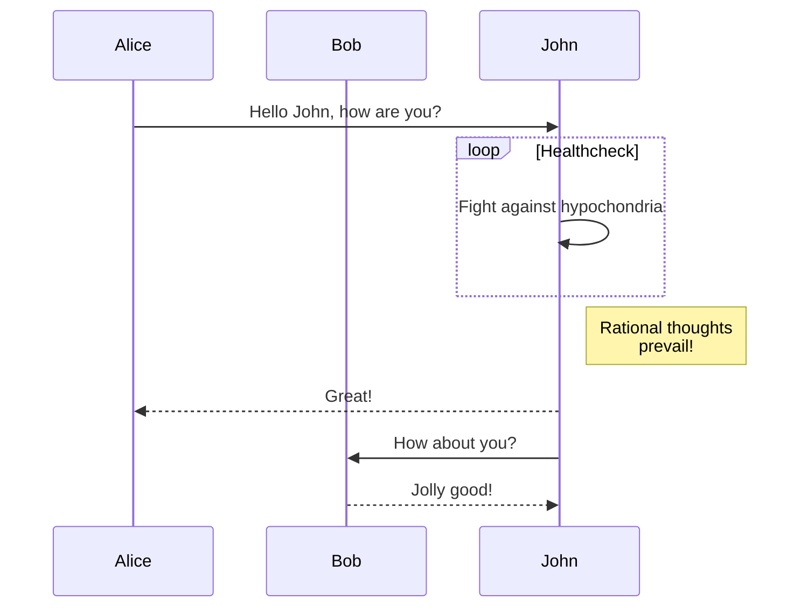

## 1 示例

https://paper.pigx.vip/

## 2 制图工具

| 名称      | 地址                                    | 特性                                                         | 推荐指数 |
| --------- | --------------------------------------- | ------------------------------------------------------------ | -------- |
| visio     |                                         | 可视化制图，单独安装，收费                                   | ★★       |
| draw.io   | https://www.draw.io/                    | 提供在线网页制图工具、单独安装包、各种IDE集成插件，软件本身也有提供额外的插件支持，可安插件来增强drawio功能。制图采用可视化拖拉拽，简单直观，容易上手。 | ★★★★★    |
| processon | https://www.processon.com/              | 网页在线制图，通过拖拉拽制图，免费版有很多限制，不推荐       | ★★       |
| plantUML  | http://www.plantuml.com/                | Java开发的，提供网页在线制图，各种IDE插件，vscode和JetBrains家族都有对应插件。采用标记语言进行制图，图片自动根据标记语言生成 | ★★★★     |
| mermaid   | https://mermaid-js.github.io/mermaid/#/ | 和PlantUML类似，也提供在线制图，支持markdown渲染，和markdown工具有关，大多md工具都会提供mermaid支持 | ★★★      |

## 3 工具选择

> 流程图、架构图推荐使用drawio

> 时序图、思维导图推荐使用PlantUML标记语言，自动生成的图比较规整好看

> 如果使用markdown,推荐使用mermaid,mermaid语法简单，和PlantUML差不多

